<div align="center">



<br>


</div>

---

## 📊 Dashboard

<table width="100%">
<tr>

<td width="33%" valign="top">

### 👤 Profile

```yaml
Name:
  Gavaskar

Role:
  Full Stack Engineer

Status:
  🟢 Available

Location:
  Sri Lanka
```

</td>

<td width="33%" valign="top">

### 🚀 Tech Stack

<p align="center">


<br><br>


</p>

</td>

<td width="33%" valign="top">

### 🎯 Current Focus

- Modern Web Apps
- UI/UX Design
- Cloud Deployment
- Automation
- Open Source

</td>

</tr>
</table>

---

<table width="100%">
<tr>

<td width="50%" valign="top">

## 📦 Featured Projects

🌿 **Medicinal Plant AI**

Computer Vision • Microservices • Docker

<br>

🤖 **Automation Lab**

n8n • APIs • Cloud Workflows

<br>

🎨 **Creative UI**

React • Tailwind CSS • SVG Animation

</td>

<td width="50%" valign="top">

## 📈 GitHub Overview


</td>

</tr>
</table>

---

<div align="center">

### 🌐 Connect

<a href="https://github.com/gitbyg4v">

</a>

<a href="https://linkedin.com/in/g4v">

</a>

<a href="https://gitbyg4v.github.io/Portfolio/">

</a>

<a href="mailto:g4v.dev@gmail.com">

</a>

</div>
