# 🛰️ SYSTEM INITIALIZED // USER: GAVASKAR

<div align="center">

<!-- Futuristic HUD SVG Header -->


<br>

<!-- Futuristic HUD Modular Dashboard Widgets -->
<table width="100%" border="0" cellpadding="4" cellspacing="6">
  <tr>
    <td colspan="2" width="67%" align="center" valign="top">
      
    </td>
    <td width="33%" align="center" valign="top">
      
    </td>
  </tr>
  <tr>
    <td width="33%" align="center" valign="top">
      
    </td>
    <td width="33%" align="center" valign="top">
      
    </td>
    <td width="33%" align="center" valign="top">
      
    </td>
  </tr>
  <tr>
    <td width="33%" align="center" valign="top">
      
    </td>
    <td width="33%" align="center" valign="top">
      
    </td>
    <td width="33%" align="center" valign="top">
      
    </td>
  </tr>
  <tr>
    <td colspan="3" width="100%" align="center" valign="top">
      
    </td>
  </tr>
</table>

<br>

<!-- Typing Subtitle matching Neon Themes -->


<p align="center">
  
  
  
</p>

</div>

---

### 💻 SYSTEM DIAGNOSTICS & TELEMETRY

> **[!] SECURE SHELL ESTABLISHED**
> *   **Primary Core:** Full-Stack Web Development, Responsive UI/UX Design, and cloud deployments.
> *   **Secondary Core:** High-Performance automation, custom vector graphic scripting, and infrastructure orchestration.

---

### ☕ COFFEE-TO-CODE CONVERTER PIPELINE

Here is the logic execution trace running continuously inside the system:

```go
func main() {
    caffeineSupply := 100
    for caffeineSupply > 0 {
        code.Write()
        bugs.Generate()
        caffeineSupply--
        
        if bugs.Count() > 0 {
            caffeineSupply -= 10 // Debugging cost
            bugs.Fix()
        }
        
        if caffeineSupply <= 5 {
            mug.Refill("Espresso")
            caffeineSupply = 100
        }
    }
}
```

---

### 👾 CONTRIB LEVEL // GRID SIMULATOR

<div align="center">

</div>

---

### 📡 COMMUNICATION CHANNELS

<div align="center">

[LinkedIn](https://linkedin.com/in/g4v) • [Gmail](mailto:g4v.dev@gmail.com) • [Interactive Portfolio](https://gitbyg4v.github.io/Portfolio/)

<br>


</div>
